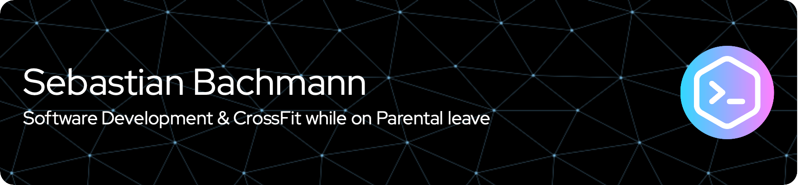

# Hi, i am Sebastian ✌️🏋🏼👨‍💻🫃🏼

- 🔭 I’m currently working on [my portfolio of small bets](https://twitter.com/buk/status/1724372383010558081)
- 🌱 I’m currently learning Elixir and Phoenix
- 🤔 I’m looking for help with Elixir and Phoenix
- 🤞 I'm also doing stuff with Ruby On Rails and mobile app development
- 💬 [Ask me anything](https://github.com/sebastianbachmann/ama) about Softwaredevelopment and staying fit while on parental leave
- 📫 How to reach me: via the Email or Mastodon handles in my profile

<!--#🌐 Socials:

 -->

<!--# 💻 Tech Stack:
  	   -->
